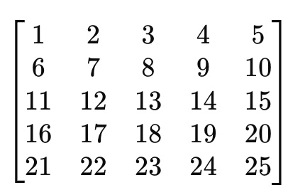
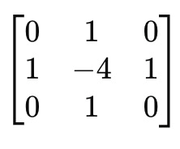
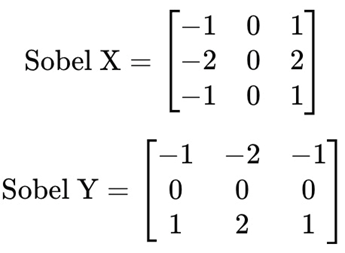

# NeuralNetworksHomeAssignment2

Student Information

- Name: Ruthvik Reddy Gaddam
- Student ID: 700755809 RXG58090
- Course: CS5720 Neural Networks CRN-23848

## Overview

This repository contains the final submission of the home assignment 2 of the Neural Networks course. The submission topics include elasticity, scalability comparision between AWS Sagemaker, Google Vertex AI and Microsoft Azure Machine Learning Studio, Convolution Operations with different parameters(stride, padding), CNN Feature Extraction (filters, pooling - max and average), Implementing alexNet and ResNet

- File Structure:
- The assignment contains 4 tasks which were implemented separately in 4 python notebooks
    - Question1
    - ha2task2.ipynb
    - ha2task3.ipynb
    - ha2task4.ipynb

## How to execute locally

Download the repository and install the mentioned packages in the requirements.txt file and run the cells of the Jupyter Notebook

## Question 1: Cloud Computing for Deep Learning (20 points)

1. Cloud computing offers significant advantages for deep learning applications.

(a) Define elasticity and scalability in the context of cloud computing for deep learning. (10 points)
(b) Compare AWS SageMaker, Google Vertex AI, and Microsoft Azure Machine Learning Studio in terms of their deep learning capabilities. (10 points)

Expected Output

definition and comparison for (a) and (b) has been given in Question1 file 

## Question 2: Convolution Operations with Different Parameters (20 points)

Task: Implement Convolution with Different Stride and Padding (10 points)

Write a Python script using NumPy and TensorFlow/Keras to perform convolution on a 5×5 input matrix using a 3×3 kernel with varying parameters.

1.	Define the following 5×5 input matrix:
 

2.	Define the following 3×3 kernel:
  

3.	Perform convolution operations with:
-	Stride = 1, Padding = ‘VALID’
-	Stride = 1, Padding = ‘SAME’
-	Stride = 2, Padding = ‘VALID’
-	Stride = 2, Padding = ‘SAME’

4.	Print the output feature maps for each case.

Expected Output

Print the output feature maps for
-	Stride = 1, Padding = ‘VALID’
-	Stride = 1, Padding = ‘SAME’
-	Stride = 2, Padding = ‘VALID’
-	Stride = 2, Padding = ‘SAME’

## Question 3: CNN Feature Extraction with Filters and Pooling (30 points)

Task 1: Implement Edge Detection Using Convolution (15 points)

Write a Python script using NumPy and OpenCV (cv2) to apply edge detection on an image using a Sobel filter.
-	Load a grayscale image (you can use any sample image).
-	Apply the Sobel filter for edge detection in the x-direction and y-direction.
-	Display the original image and the filtered images.

Use the following Sobel filters:

 
Task 2: Implement Max Pooling and Average Pooling (15 points)

Write a Python script using TensorFlow/Keras to demonstrate Max Pooling and Average Pooling.
  -	Create a random 4x4 matrix as an input image.
  -	Apply a 2x2 Max Pooling operation.
  -	Apply a 2x2 Average Pooling operation.
  -	Print the original matrix, max-pooled matrix, and average-pooled matrix.

Expected Output

Task1: Edge Detection using Sobel Filter
•	Display three images:
  1.	Original Image
  2.	Edge detection using Sobel-X
  3.	Edge detection using Sobel-Y

Task2: Pooling Operations on Random 4×4 Matrix
•	Printed original matrix, max pooled matrix, and average pooled matrix.
 

## Question 4: Implementing and Comparing CNN Architectures (30 points)

Task 1: Implement AlexNet Architecture (15 points)

Write a Python script using TensorFlow/Keras to implement a simplified AlexNet model with the following layers:

  -	Conv2D Layer: 96 filters, kernel size = (11,11), stride = 4, activation = ReLU
  -	MaxPooling Layer: pool size = (3,3), stride = 2
  -	Conv2D Layer: 256 filters, kernel size = (5,5), activation = ReLU
  -	MaxPooling Layer: pool size = (3,3), stride = 2
  -	Conv2D Layer: 384 filters, kernel size = (3,3), activation = ReLU
  -	Conv2D Layer: 384 filters, kernel size = (3,3), activation = ReLU
  -	Conv2D Layer: 256 filters, kernel size = (3,3), activation = ReLU
  -	MaxPooling Layer: pool size = (3,3), stride = 2
  -	Flatten Layer
  -	Fully Connected (Dense) Layer: 4096 neurons, activation = ReLU
  -	Dropout Layer: 50%
  -	Fully Connected (Dense) Layer: 4096 neurons, activation = ReLU
  -	Dropout Layer: 50%
  -	Output Layer: 10 neurons, activation = Softmax

Print the model summary after defining it.

Task 2: Implement a Residual Block and ResNet (15 points)

Write a Python script to define a Residual Block and use it to build a simple ResNet-like model.

1.	Implement a function residual_block(input_tensor, filters) that:
  -	Takes an input tensor.
  -	Applies two Conv2D layers (each with 64 filters, kernel size = (3,3), activation = ReLU).
  -	Includes a skip connection that adds the input tensor to the output before activation.

3.	Create a ResNet model that:
  -	Uses an initial Conv2D layer (64 filters, kernel size = (7,7), stride = 2).
  -	Applies two residual blocks.
  -	Ends with a Flatten layer, Dense layer (128 neurons), and Output layer (Softmax).

Print the model summary after defining it.
Expected Output
The output should display:

-	The model summary for AlexNet.
-	The model summary for the ResNet-like model.

